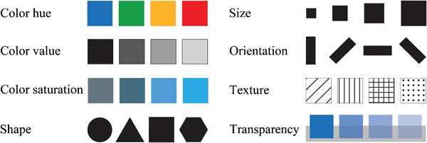

```{r setup, include=FALSE}
knitr::opts_chunk$set(echo = TRUE)
```

# Tufte's principles

Keep Tufte's principles slides as it's a way for them to understand what makes a good and bad plot. Might be worth collapsing the ideas down with the advice of @few2008practical on use of colour.

# Few's rules

@few2008practical 

Rule 1: If you want different objects of the same color in a table or graph to look the same, make sure that the background (the color that surrounds them) is consistent. (A gradient background just adds confusion).

Rule 2: If you want objects in a table or graph to be easily seen, use a background color that contrasts sufficiently with the object.

Rule 3: Use color only when needed to serve a particular communication goal.

Rule 4: Use different colors only when they correspond to differences of meaning in the data. <!-- (Adding a different color for each country to a bar chart adds nothing when you already have identified their names). -->

Rule 5: Use soft, natural colors to display most information, and bright colors and/or dark colors to highlight information that requires greater attention. <!-- (He gives an example of palette with eight soft natural and bright highlight colors).-->

Rule 6: When using color to encode a sequential range of quantitative values, stick with a single hue (or a small set of closely related hues) and vary intensity from pale colors for low values to increasingly darker and brighter colors for high values.

Rule 7: Non-data components of tables and graphs should be displayed just visibly enough to perform their role, but not more so, for excessive salience could cause them to distract attention from the data. <!-- (The scales and borders should not visually overwhelm your data).-->

Rule 8: To guarantee that most people who are colorblind can distinguish groups of data that are color coded, avoid using a combination of red and green in the same display. <!-- (About 10% of men cannot tell red from green, and identify traffic lights by position only!) -->

Rule 9: Avoid using visual effects in graphs. (A plain bar chart is preferable to one with three-dimensional rods).

# Visual style

Every publication (journal, newspaper, news service, etc.) has its own house style for visualisation. This is all about creating a coherent graphical framework that makes it easy for the reader to engage with visual information the same way a consistent set of font family, face and size, and referencing style allows easy digestion of text. Changing these things would make the experience jarring for the reader and can contribute to a sense that the information is coming from multiple sources.

# Visual language

In addition to the colour and theming options, it's important that your plots have a consistent visual language. This may mean keeping colour schemes consistent only when the same grouping variable is used and changing the colour scheme for a new grouping variable. 

In addition to colour schemes, it's important that the same geometries are used to display the same style of variable. Switching back and forth between points, lines and bars to show the same type of variable (indeed, for the same variable in multiple plots) can make it difficult for the reader to understand that the plots share a context.

# Use of Colour

RColorBrewer [@RColorBrewer] implements the colour palette system of https://colorbrewer2.org/ which is an update to the work of @harrower2003colorbrewer, itself. These tools were developed to provide reader-friendly colour schemes that help, among things, maximise differences in hue and maintain a perceptually consistent scale.

Figure 5 of @Kunz2011 indicates which visual variables we may have control over. It's worth considering which of these are appropriate in order to highlight differences.



Tufte indicates that the use of texture (hatching) should be avoided as it creates visually noisy diagrams.

# References

