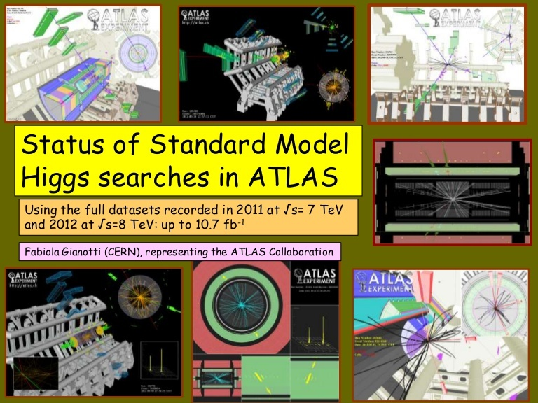

    
```{r global_options, include=FALSE}
library(knitr)
opts_knit$get('out.format')
knit_patterns$set(all_patterns[['rnw']])

library(tidyverse)
library(ggthemes)
library(rdefra)
library(magrittr)
library(lubridate)

output <- opts_knit$get('rmarkdown.pandoc.to')
knitr::opts_chunk$set(echo = FALSE, collapse=T, warning=FALSE, message=FALSE,
                      fig.align='center', out.width = '100%',
                      fig.width=4,  fig.height=2,
                      dev = "cairo_pdf")

library(extrafont)
loadfonts()

def.chunk.hook  <- knitr::knit_hooks$get("chunk")
knitr::knit_hooks$set(chunk = function(x, options) {
    x <- def.chunk.hook(x, options)
    ifelse(options$size != "normalsize", paste0("\n \\", options$size,"\n\n", x, "\n\n \\normalsize"), x)
})

```


# What are publication ready graphics?

### What do we mean?

* Target audience outside the analysis team

* Clean and accessible presentation of information

* Easy to understand without intimate knowledge of work

* Human-friendly annotations where reasonable

* Looks professional


### Principles of visualisation

Recall [@tufte; @pantoliano]


* Show the data

* Provide clarity

* Allow appropriate comparisons

* High data density

* Avoid chartjunk

* Avoid recycling variables

### Principles of visualisation

Visual impairments of readers to be considered [@world2014visual]

- visual acuity

- colour perception

- light sensitivity

- contrast sensitivity

- field of vision
    
\vspace{24pt}
    
Meaningful captions can help address these issues

### Principles of visualisation


* Consistent, soft background colour 

* Highlights in easily distinguishable bright or dark colours

* Colour use must be deliberate and serve communication 

    - change in colour implies change in meaning

    - single-hue scale for sequential data 

    - multi-hue scale through neutral for diverging data 

    - different hues for qualitative data 
    
[@Brewer1997; @stone2006choosing; @few2008practical]

### Principles of visualisation

* How does the visualisation support decision-making?

* Does the visualisation communicate uncertainty properly?

* Non-data annotations should not distract from data

* Avoid common colourblindness traps

* Avoid visual effects (3D, drop shadows)

[@tufte; @visstatthink1997; @few2008practical]

# Exercise

###

\huge

EXERCISE

\vspace{1em}

\normalsize

Complete activity 1 in the practical document

# Visual style and language

### Visual style

* Defaults suck, always

* Every publication has a house style

* Create a coherent graphical framework

    - easy for reader to engage

    - consistent theming

    - consistent annotation attributes

    - clear that information comes from same place

* How much detail in caption?
    
    
### 


::: columns

:::: column

``` {r, eval=T, echo=F, warning=FALSE, message=FALSE, fig.width=4, fig.height=4, fig.cap="Change in bone mineral density with age", res=300}

library(hrbrthemes)
library(dplyr)
library(stringi)
library(magrittr)

data(bone, package = "ElemStatLearn")

bone %<>%
  count(idnum) %>%
  inner_join(bone) %>%
  mutate(gender = stri_trans_totitle(gender))

bone.singleton <- bone %>%
  filter(n==1)

bone.repeats <- bone %>%
  group_by(idnum) %>%
  filter(n > 1)

bone_example <- 
    ggplot(data = bone,
       aes(x = age, y = spnbmd)) +
    facet_wrap( ~ gender, ncol = 1) + 
    labs(
        x = "Age (years)",
        #y = expression(Rel.~Bone~Mineral\\n~Density~(g ~ cm ^ {-3}~yr^{-1})))
        y = expression(Relative~spinal~bone~mineral~density~(g~cm^{-3}~yr^{-1})))

bone_example + geom_point()

```

:::: 

:::: column

``` {r, eval=T, echo=F, warning=FALSE, message=FALSE, fig.width=4, fig.height=4, fig.cap="Average rate of change (relative) of spinal bone mineral density over time in healthy male and female youths. Lines show individuals with more than two observations. Data sourced from Bachrach et al. (1999) J Clin Endocrin Metab 84 (12): 4702-12", res=300}

bone_example + 
    geom_point(data = bone.singleton,
               alpha = 0.5, stroke=0, pch=19,
               size=0.75) +
    geom_line(data=bone.repeats,
              aes(group = idnum), alpha = 0.125) +
    
    theme_bw() +
    theme(text = element_text(family = "Roboto Condensed"),
          strip.background = element_blank(),
          strip.text = element_text(size = 12, hjust = 1)) +
    geom_smooth(alpha = 0.5,
                method="gam", formula = y ~s(x, bs="ps", k=6), 
                fill="lightskyblue", 
                color = "black",
                #method="loess", color="lightskyblue",
                size=1) 

```
    
:::: 

:::
    
### Visual style - BBC

![Example plots by BBC data team [@bbcplot]](bbc.png)

### Visual style - The Economist

![Example plots by The Economist [@selby-boothroyd_2018]](economist.png)

These are slightly more infographic in nature [@Scott1104], an effective way to tell a story with text and graphics

### Visual style

What does your choice of theme, plot style, colour, font, etc. suggest about how:

- professional
- modern
- exciting
    
you and your work are?

\vspace{24pt}

Is your plot aesthetically pleasing?

\vspace{24pt}

How **readable** are your labels and annotations **at a glance**? 


### 

But most importantly...

\vspace{24pt}

\LARGE


Is it easy for the reader to understand what you are showing them?


### Visual language

* Your plots must look like they've come from the same place

* Should also look like each has been thoughtfully created

* Choice of colour scheme

    - is there a colour scheme related to your topic?

    - avoid reusing colour scheme for multiple variables

* Choice of geometries for each variable (or pair)

* Is 0 a meaningful value on your $y$ axis?


### Visual language

![Aesthetics we have control over [Figure 5, @Kunz2011]](ycaj_a_11667687_f0005_b.jpeg)

Choose how each element will be used (if at all) in your plots


### Visual language

``` {r, echo = FALSE, fig.width = 8, fig.height = 6}
library(patchwork)
library(magrittr)

theming <- theme_bw() + theme(text = element_text(family = "Lato", size = 12),
                              legend.position = "bottom")

data(mtcars)
mtcars %<>% mutate(am = ifelse(am == 0, "Automatic", "Manual"),
                   vs = ifelse(vs == 0, "V-shaped", "Straight"),
                   kmL = 0.425144 * mpg,
                   `L/km` = 1/kmL,
                   wt = wt*0.453592)

p1 <- ggplot(data = mtcars, aes(x = factor(cyl))) +
    geom_bar(aes(fill = factor(am))) +
    labs(fill = "Transmission") + theming +
    xlab("Cylinders") + ylab("Number of vehicles")


p2 <- ggplot(data = mtcars, aes(x = wt, y = `L/km`)) +
    geom_point(aes(color = factor(am))) +
    labs(color = "Transmission", x = "Weight (tonnes)", 
         y = expression(Fuel~efficiency~(L~km^{-1}))) + theming +
    ylim(c(0,NA)) + 
    xlim(c(0,NA))


p3 <- ggplot(data = mtcars, aes(x = factor(cyl))) +
    geom_bar(aes(fill = factor(vs)))  +
    labs(fill = "Engine shape") + theming +
    xlab("Cylinders") + ylab("Number of vehicles")


p4 <- mtcars %>%
    arrange(cyl, `L/km`) %>%
    mutate(id = factor(1:n()),
           id = fct_inorder(id, ordered = T)) %>%
    ggplot(data = .,
             aes(x = factor(cyl))) + 
    geom_linerange(aes(ymin = 0, ymax = `L/km`, color = am,
                       group = id,),
                   position = position_dodge(width = 0.5)) +
    theming + 
    labs(color = "Transmission", x = "Cylinders", 
         y = expression(Fuel~efficiency~(L~km^{-1})))

wrap_plots(p1, p2, p3, p4)

```


### Visual language - alternative

``` {r, echo = FALSE, fig.width = 8, fig.height = 6}


p2 <- ggplot(data = mtcars, aes(x = wt, y = `L/km`)) +
    geom_point(aes(color = factor(am))) +
    labs(color = "Transmission", x = "Weight (tonnes)", 
         y = expression(Fuel~efficiency~(L~km^{-1}))) + theming 

engine_cols <- RColorBrewer::brewer.pal(3, "PuOr")[c(1,3)]

p3 <- ggplot(data = mtcars, aes(x = factor(cyl))) +
    geom_bar(aes(fill = factor(vs)))  +
    labs(fill = "Engine shape") + theming +
    xlab("Cylinders") + ylab("Number of vehicles") +
    scale_fill_manual(values = engine_cols)


p4 <- ggplot(data = mtcars, aes(x = wt, y = `L/km`)) +
    geom_text(aes(color = factor(am),
                   label = cyl),
               size = 4) +
    labs(color = "Transmission\n(cylinders as text)", x = "Weight (tonnes)", 
         y = expression(Fuel~efficiency~(L~km^{-1}))) + theming +
    theme(legend.box = "vertical") +
    guides(color = guide_legend(override.aes = list(label = "6")))

wrap_plots(p1, p2, p3, p4)

```

# Effective use of colour

### Effective use of colour

@RColorBrewer implements colour palettes of [ColorBrewer](https://colorbrewer2.org)  [@Brewer1997; @harrower2003colorbrewer]

``` {r, echo = FALSE, fig.width = 6, fig.height = 3}
n <- 5
pal_ex <- list("Greens", "YlGnBu", "Set2", "Dark2", "PuOr", "RdYlBu") %>%
    set_names(., .) %>%
    map(~RColorBrewer::brewer.pal(n, .x)) %>%
    map_df(~data.frame(x = 1:n, color = .x), .id = "palette") %>%
    mutate(palette = fct_inorder(palette))


col <- as.character(pal_ex$color)
col %<>% set_names(., .)

ggplot(data = pal_ex, aes(x = x, y = palette)) +
    geom_tile(aes(fill = color), color = "black") +
    facet_wrap( ~ palette, ncol = 1, scales = "free_y") +
    theme_minimal() +
    theme(legend.position = "none", 
          strip.background = element_blank(),
          strip.text = element_blank(),
          axis.title = element_blank(),
          panel.grid = element_blank(),
          #xis.text.y = element_blank(),
          axis.ticks = element_blank(),
          axis.text.x = element_blank(),
          axis.line = element_blank()) +
    scale_fill_manual(values = col)
```

`... + scale_color_brewer(palette = 'Greens')`


### Effective use of colour

Viridis colour scales are perceptually uniform and viewable by those with most common form of colour blindness [@smith2015better]

``` {r, echo = FALSE, fig.width = 6, fig.height = 3}
n <- 20
vir_ex <- as.list(LETTERS[1:5]) %>%
    set_names(., .) %>%
    map(~viridis::viridis_pal(option = .x)(n)) %>%
    map_df(~data.frame(x = 1:n, color = .x), .id = "palette") %>%
    mutate(palette = fct_inorder(palette))


col <- as.character(vir_ex$color)
col %<>% set_names(., .)

ggplot(data = vir_ex, aes(x = x, y = palette)) +
    geom_tile(aes(fill = color), color = "black") +
    facet_wrap( ~ palette, ncol = 1, scales = "free_y") +
    theme_minimal() +
    theme(legend.position = "none", 
          strip.background = element_blank(),
          strip.text = element_blank(),
          axis.title = element_blank(),
          panel.grid = element_blank(),
          #xis.text.y = element_blank(),
          axis.ticks = element_blank(),
          axis.text.x = element_blank(),
          axis.line = element_blank()) +
    scale_fill_manual(values = col)
```

`... + scale_color_viridis(option = 'D')`

### Effective use of colour

* [Check whether a pair of colours is high enough contrast for those with low vision](https://webaim.org/resources/contrastchecker/)

* [Check whether an image is colourblind-friendly](https://www.color-blindness.com/coblis-color-blindness-simulator/)

* [Adobe Color Wheel to generate palettes](https://color.adobe.com/)


# Plot dimensions

### Aspect ratio

* Typical aspect ratios include

    - 1:1, R default

    - 4:3, matplotlib default

* Might be sub-optimal for showing features of interest

* *Bank* the rate of change to be 45$^{\circ}$ to aid interpretability of change in slope [@cleveland1988shape]

* Plot needs to be big enough that annotation text $\approx$ body text

<!-- * Implemented in ggthemes with `bank_slopes()` -->

### Aspect ratio

``` {r, echo = FALSE}
if (!file.exists("ABD.csv")){
    
    ABD <- rdefra::ukair_get_hourly_data("ABD", years = seq(2000, 2009))
    
    ABD_NO2 <- ABD %>%
        mutate(Date = lubridate::floor_date(datetime, "day")) %>%
        group_by(Date) %>%
        summarise(NO2 = mean(Nitrogen.dioxide, na.rm=T))
    
    ABD_NO2_avg <- 
        ABD_NO2 %>% #na.omit %>%
        mutate(Date = as.Date(Date)) %>%
        {zoo(.$NO2, .$Date)} %>%
        zoo::rollmean(., k = 28) %>%
        data.frame(NO2 = .) %>%
        rownames_to_column("Date") %>%
        mutate(Date = as.Date(Date)) %>%
        mutate(Date_ = as.numeric(Date)) 
    
    write_csv(x = ABD_NO2_avg, file = "ABD.csv")
    
} else {
    ABD_NO2_avg <- read_csv("ABD.csv")
}

ABD_NO2_avg %>%
    na.omit %>%
    summarise(xy = ggthemes::bank_slopes(x = Date_,
                                         y = NO2,
                                         method = "as")) -> xy

library(mgcv)
ABD_plot <- 
    ABD_NO2_avg %>% #na.omit %>%
    mutate(yday = yday(Date)) %>%
    bind_cols(., data.frame({predict(object = gam(data = .,
                                                  NO2 ~ s(yday, bs= "cp")),
                                     se.fit = T,
                                     newdata = .)})) %>%
    mutate(L = fit - 1.96*se.fit,
           U = fit + 1.96*se.fit) %>%
    #{left_join(ABD_NO2_avg, .)} %>%
    ggplot(data = ., aes(x = Date, y = NO2)) +
    geom_line(aes(y = fit, color = "Modelled annual trend")) +
    geom_ribbon(aes(ymin = L,
                    ymax = U),
                alpha = 0.5, show.legend = FALSE,
                fill = "lightskyblue") +
    geom_line(aes(color = "28 day rolling mean")) +
    theme_bw() +
    ylab(expression(NO[2]~(mu*g~m^{-3}))) +
    ggtitle("Background concentration of nitrogen dioxide in Aberdeen") +
    scale_x_date(date_breaks = "1 year", date_minor_breaks = "1 month", 
                 date_labels = "%Y") +
    theme(axis.text.x = element_text(angle = 45, hjust = 1)) +
    xlab("") +
    scale_color_manual(values = c("28 day rolling mean" = "black",
                                  "Modelled annual trend" = "lightskyblue"),
                       name = "") +
    theme(legend.position = 'bottom')
```


``` {r, echo = FALSE, fig.width = 6, fig.height = 4}
ABD_plot
```

### Aspect ratio

``` {r, echo = FALSE, fig.width = 6, fig.height = 2}
ABD_plot + ylim(c(0, NA)) + coord_fixed(ratio = 365*xy) +
     scale_x_date(date_breaks = "1 year", date_minor_breaks = "3 months", 
                 date_labels = "%Y")
```

* Easier to identify difference between model & rolling mean

* Peak around December/January more obvious

* Breaks in lines more visible

* Previous plot has more obvious vertical range

# Theme options

### Theme options - ggplot2

``` {r, echo = FALSE, fig.width = 6, fig.height = 4}
library(patchwork)
# remotes::install_url("https://cran.r-project.org/src/contrib/Archive/ElemStatLearn/ElemStatLearn_2015.6.26.2.tar.gz")
data(bone, package = "ElemStatLearn")
make_plots <- function(x){
    set_names(x,x) %>%
        map(~paste("ggplot(data = bone, aes(x = age, y = spnbmd)) + geom_point()", 
                   .x,
                   paste0("ggtitle('",.x,"')"),
                   "labs(x = 'Age (years)', y = 'Relative spinal\nbone density')",
                   sep = " + ")) %>%
        map(~eval(parse(text = .x))) %>%
        wrap_plots(.)
}

list("theme_bw()",
     "theme_dark()",
     "theme_grey()",
     "theme_classic()") %>% make_plots


```

### Theme options - ggthemes

``` {r, echo = FALSE, fig.width = 8, fig.height = 6}
library(ggthemes)
list(#"theme_economist()",
     "theme_excel()",
     "theme_few()",
     "theme_stata()",
     #"theme_tufte()",
     "theme_wsj()") %>% make_plots
```

<!-- ### Theme options - hrbrthemes -->

<!-- ``` {r, echo = FALSE, fig.width = 8, fig.height = 6} -->
<!-- library(hrbrthemes) -->
<!-- list("theme_ipsum()", -->
<!--      "theme_ipsum_rc()", -->
<!--      "theme_modern_rc()", -->
<!--      "theme_ft_rc()") %>% make_plots -->
<!-- ``` -->

# Fonts

### Choosing fonts

* Like plot itself, font choice must serve interpretation and enhance credibility

* Fonts should be legible, especially at size being used

* Annotation font should match/complement body text

* Avoid default system fonts like Times New Roman or Arial

    - [Butterick's Practical Typography - System fonts](https://practicaltypography.com/system-fonts.html)
    - [Choosing fonts for your data visualisation](https://medium.com/nightingale/choosing-a-font-for-your-data-visualization-2ed37afea637) [@france_2020]
    - [Google Fonts](https://fonts.google.com/)

* Avoid artistic fonts

### Choosing fonts in ggplot2

See section 14.6, 14.7 of @changgraphics

::: columns

:::: column

``` {r, echo = TRUE, size = "tiny"}

library(extrafont)
loadfonts()

bone_plot <-
    ggplot(data = bone,
           aes(x = age, 
               y = spnbmd)) +
    geom_point() + 
    theme_bw() + 
    labs(
        x = 'Age (years)',
        y = paste(
            'Relative spinal',
            'bone density',
            sep = '\n')) 

```

``` {r, eval = FALSE, echo = TRUE, size = "tiny"}
bone_plot +
    theme(text = element_text(
        family = 'Papyrus', 
        size = 16))

bone_plot +
    theme(text = element_text(
        family = 'Lato', 
        size = 16))

```

::::

:::: column

``` {r, echo = FALSE, fig.width = 4, fig.height = 2}
bone_plot +
    theme(text = element_text(
        family = 'Papyrus', 
        size = 16))

bone_plot +
    theme(text = element_text(
        family = 'Lato', 
        size = 16))

```

::::

:::

# Saving plots

### Saving plots

* Many academic journals will require a

    - PDF for vector images (diagrams, plots made of lines, points, etc.)
    
    - TIFF for raster images (photographs, pixel-based plots)
    
    - PNG might be acceptable for web viewing
    
* Whatever the target audience, they deserve a high quality rendering

* Vector graphics can be enlarged indefinitely

* Raster graphics can become highly pixellated quickly

### Saving plots

* `ggsave()` can handle all the common image file extensions

* Allows us to set image resolution for rasters (suggest 300)

* Specify height and width (and in what units)

``` {r, eval = FALSE, echo = TRUE, size = "tiny"}
ggplot2::ggsave(filename,  # file to create, optionally including format
                plot,      # plot to save
                device,    # if not clear from filename, file format
                path,      # folder to save file in
                scale,     # a multiplicative scaling factor
                width,
                height,
                units,     # for width and height, e.g. "in", "cm", "px"
                dpi,       # for png/bmp/jpg/gif (dots per inch)
                limitsize) # to avoid mixing units up and making huge files
```

# Exercise

###

\huge

EXERCISE

\vspace{1em}

\normalsize

* Complete activity 2 in the practical document

    - 2a: Best version of plot
    
    - 2b: Worst version of plot
    
* Activity 3 - Discussion 

# Summary

### Summary

No matter how outstanding the work, poor graphics and font choice can distract from the message

\vspace{24pt}

```{r, echo=FALSE, out.width="70%", fig.cap="Title slide for presentation of ATLAS experiment at CERN announcement of Higgs Boson discovery (2012)"}

```

### Summary - Additional Resources

* @changgraphics has lots of examples

* @hadley2020ggplot2 goes more into the theory behind ggplot2

* [Perceptual Edge](http://www.perceptualedge.com/library.php) has a list of Stephen Few's books and articles

* [Edward Tufte's website](https://www.edwardtufte.com/tufte/) is full of critiques of visualisation, his theories of design, articles/pamphlets he's written, and art prints of his work

